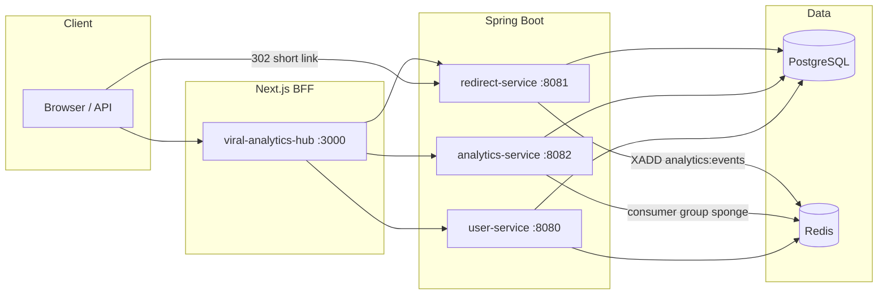

# Virallink

[](https://github.com/ehdro06/viral-analytics-hub/actions/workflows/ci.yml)


B2B URL shortener and click analytics platform. Short links resolve on a **decoupled redirect path** (302 first, analytics async); the dashboard polls scoped aggregates—no WebSockets in this MVP.

**Status:** Local-dev MVP. Core flows work end-to-end; production deploy, API-key Redis cache, and billing are out of scope for now.

## Architecture



| Service | Port | Responsibility |
|---------|------|----------------|
| **user** | 8080 | OAuth2/OIDC, JWT, API keys |
| **redirect** | 8081 | Hashids links, hot-path 302, URL expand + Safe Browsing |
| **analytics** | 8082 | Redis Stream consumer, GeoIP/UA enrichment, tenant-scoped summaries |
| **viral-analytics-hub** | 3000 | Dark-mode dashboard, TanStack Query polling |

## Quick start

**Prerequisites:** JDK 25, Node 22+, pnpm, Docker (Postgres, Redis, and Testcontainers-backed tests).

```bash
git clone https://github.com/ehdro06/viral-analytics-hub.git
cd viral-analytics-hub
cp .env.example .env   # fill JWT_SECRET, API_KEY_SIGNING_SECRET, HASHIDS_SALT

docker compose up -d

# Each JVM service: copy gradle.properties.example → gradle.properties (JDK path)
cd user && ./gradlew bootRun
cd redirect && ./gradlew bootRun
cd analytics && ./gradlew bootRun

cd viral-analytics-hub && pnpm install && pnpm run dev
```

Full steps, env table, and smoke test: **[docs/LOCAL_DEV.md](docs/LOCAL_DEV.md)**.

Agent handover (what’s done, what’s next): **[docs/HANDOVER.md](docs/HANDOVER.md)**.

Click stream contract: **[docs/click-events-stream.md](docs/click-events-stream.md)**.

## Repository layout

```
├── user/                 # Identity & sessions
├── redirect/             # Links, redirects, expander
├── analytics/            # Stream ingestion & reporting API
├── viral-analytics-hub/  # Next.js frontend
├── docs/                 # Local dev & integration notes
├── infra/                # Postgres init
└── docker-compose.yml    # Postgres + Redis for local dev
```

## What this MVP includes

- Async click pipeline: redirect publishes to Redis Stream `analytics:events`; analytics **batch sponge** persists with ack-after-write
- **Tenant-scoped** analytics (`userId` / `linkId` on each event)
- JWT-secured dashboard APIs; HMAC-signed API keys (`prefix.secret`)
- Frontend live polling (`refetchInterval` 10s, pauses in background)

## Out of scope (by design)

- WebSockets / SSE for live clicks
- Custom domains & SSL automation
- Stripe / usage tiers
- Redis-backed API key validation (documented for a later phase)

## Contributing

See **[CONTRIBUTING.md](CONTRIBUTING.md)**.

## License

[MIT](LICENSE)
